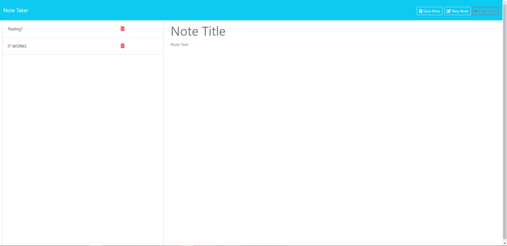

# Note Taker 2.0

[](https://opensource.org/licenses/MIT)

## Live Preview


## Description
The Simple Note Taker is a lightweight web application built on the Express.js framework, utilizing UUID for unique identification and the FileSystem (fs) module for data storage. This note-taking tool provides users with a straightforward interface to create, save, and delete notes effortlessly.

## Live Preview


## Table of Contents
- [Installation](#installation)
- [Usage](#usage)
- [Credits](#credits)
- [License](#license)
## Installation
Before using this application, you'll need to install the necessary dependencies. To do this, follow these steps: 
```
npm Install

node Server
```

## Usage
Access the application in your web browser at http://localhost:3001.

Click on the "Get Started" button to access the note-taking interface.

To create a new note:

Enter a title and your note text. Click the save button.

Click on the note in the left-hand column.

To delete a note. Click the trash can icon next to the note.
## License 
### This project is licensed under the terms of the 
## MIT [https://opensource.org/licenses/MIT](https://opensource.org/licenses/MIT)

## Contributing
If you would like to contribute to this project, please follow the guidelines outlined in the Contributing Guide.

## Questions
If you have questions or need further assistance with this project, please feel free to contact me via:
- E-Mail: CarrilloUriel81@gmail.com
- GitHub: [UCarr81](https://github.com/UCarr81)
